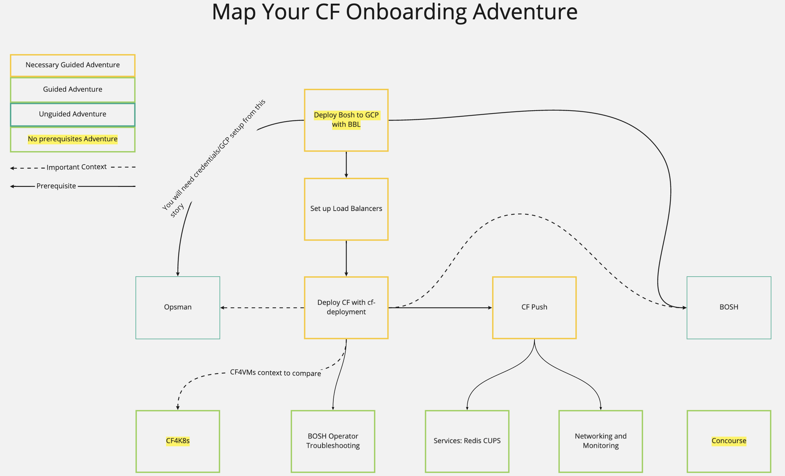

# Kickoff Meeting:

Summary: This is just a guide to get you started on your kickoff meeting.

----

What is your:
-> Name
-> What do you do at Pivotal?
-> Tenure at Pivotal?
-> Any specific goals for this week?

What is CF Onboarding?
30K feet:
-> Self paced learning (tracker backlog)
-> Working together with peers
-> Gaining knowledge drawn from trial and error
    -> Something more experienced pairs can sometimes shield us from

More concretely:
-> Tracker Back Log
-> BOSH on GCP
-> CF on BOSH
-> Freeform: Concourse

— Improve the cariculum.

——
Standard Pairing: (Is anyone new to pairing?)
-> Be conscious of your pair's needs. 
    -> space / keyboard equality
-> Support one another. 
-> Teach one another.

-> When you learn something new, tell your pair. 
-> Get in the habit of being honest about ignorance and progress. 
-> This is going to be very valuable for your learning skills as well as your pairs teaching skills.

-> Learn to be comfortable with the idea of breaking something. 
    -> If you're afraid to break your environment, you'll have a harder time learning and exploring.

——
Day-to-day:
* #cf-onboarding-week Slack channel
* I will come by after my standup to see if anyone is stuck.
* I will also come by after lunch to see if anyone is stuck.
* I suggest running a short standup in the morning to potentially rotate pairs and help unstick other pairs.
* Boxes && line talks interspersed
* Retro on Friday
* Cleanup GCP after.

——
Current Boxes && Lines
* BOSH (Garima NYC)
* CF Overview (Nat / Tom)
* Concourse (James Ma)
* K8s (Pair EL and Sr SWE)
* 
* Note: Some presentations are remote.

 ——

Things to consider: (prior feedback)
-> Try rotating after lunch instead of in the morning. 
    -> This can help with context retention and knowledge sharing.

-> If the last hour or so of the day is hard to get through, use it however will feel most productive. 
    -> This could mean separating from your pair to read docs or grabbing a laptop to work on your own.

-> Thursday and Friday are good days for the more free-form exploratory modules.
  -> EOD Friday for cleanup.

-> Fundamentally onboarding is for you, so think about what you want out of this week and pursue that. The backlog introduces guidance but feel free to go off-the rails.

-> This is an engineering heavy set of work so, consider dividing engs evenly across pairs.

-> Consult the skill chart for an understanding of how epics fit together and which tracks rely on others. 

——

-> CF Onboarding is run by volunteers and we are always looking for more facilitators to help. (#onboarding-staff)
  -> Note that many facilitatiors move on to be managers.

-> If you can improve stories or want to add some please generate PRs here: https://github.com/pivotal/cf-onboarding

——

Okay, we done!

-> Go show them the machines and the back log.
